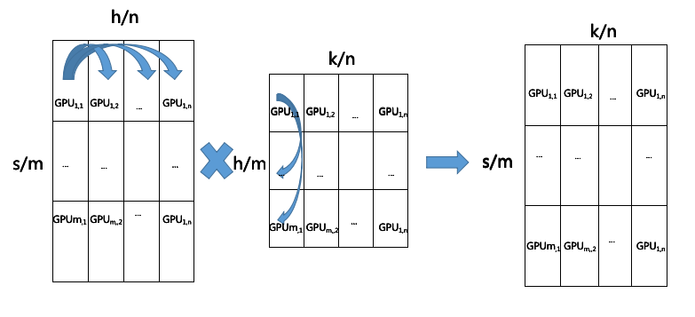
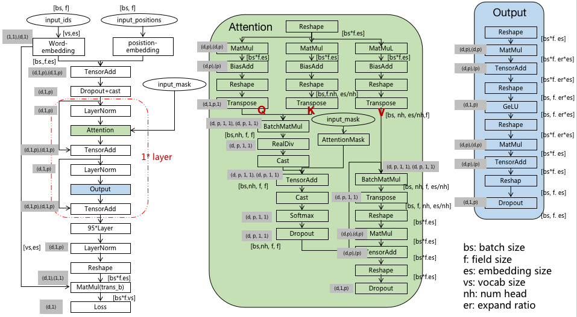

# Matrix Multiplication Parallelism

We implement a new parallel algorithm for matrix multiplication on the mindspore framework, provide more flexible segmentation strategies, and test the proposed parallel algorithm according to the Pangu model. Our algorithm has been merged into the [mindspore1.9](https://github.com/mindspore-ai/mindspore.git) version, and the specific code is implemented in [matmul_info.cc](https://github.com/mindspore -ai/mindspore/blob/r1.9/mindspore/ccsrc/frontend/parallel/ops_info/matmul_info.cc) file.

Introduction

In our  algorithm, matrices are divided into $m \times n $ blocks. It's not necessary that $m=n$ , so that GPU resources can be fully utilized. After performing the parallel matrix multiplication, the operation result matrix is still divided according to $m \times n$ blocks, without rearranging, reducing communication requirements.

For the multiplication of two matrices $A$, $B$, $A\times B=C$, where $A\in \mathbb{R}^{s \times h}, B\in \mathbb{R}^ {h \times k}, C\in \mathbb{R}^{s \times k}$, respectively divide the matrix `A`, `B` into $m$ blocks according to rows, and $n$ according to columns piece. For the $A$ matrix, $GPU_{i,1},GPU_{i,2},...,GPU_{i,n}$ communicate with each other, and spliced into a small matrix $A_i\in \mathbb{R }^{s/m \times h }$; for $B$ matrix, $GPU_{1,j},GPU_{2,j},...,GPU_{m,j}$ communicate with each other, and by row Stitched into a small matrix $B_j\in \mathbb{R}^{h \times k/n }$, for $GPU_{i,j}$, the operation result is $A_i \times B_j = C_{i.j}$, $C_{i,j}\in \mathbb{R}^{s/m \times k/n}$. As shown below



We provide a new parallel strategy for the parallel training of transformers. Taking Pangu-alpha as an example, its parallel strategy is shown in the figure below:



## Installation

First, you need to install the mindspore Ascend version or GPU version, and then install the following python libraries according to the [Pangu-alpha](https://gitee.com/mindspore/models.git) guidelines.

mindspore 1.9.0 or higher version

* jieba 0.42.1
* sentencepiece 0.1.94
* transformers >= 4.7.0

## Train

We have modified the parallel strategy of the model. When running the distributed training script, the above parallel strategy will be executed.

```
bash scripts/run_distribute_train.sh DATASET RANK_TABLE RANK_SIZE TYPE MODE STAGE_NUM MICRO_SIZE PER_BATCH RANK_START
```

## Reference

[Pangu-alpha](https://gitee.com/mindspore/models.git)

[mindspore](https://github.com/mindspore-ai/mindspore.git)
